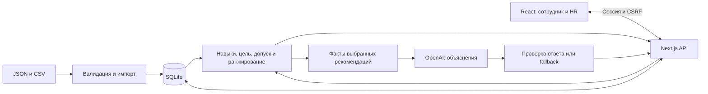

# Career Quest

**Навигатор развития сотрудников для кейса Halyk Bank на HackAlem AI.**

Career Quest помогает сотруднику понять, каких навыков не хватает для следующей роли или грейда и какое обучение поможет их развить. Приложение связывает профиль, требования должности и историю участия с конкретными рекомендациями. HR получает обзор дефицитов навыков и может добавлять сотрудников без изменения кода.

Подбор мероприятий и расчёт прогресса выполняются по воспроизводимым правилам. OpenAI дополняет выбранные рекомендации объяснениями. Без API-ключа профиль, рекомендации, импорт и завершение обучения продолжают работать.

## Что реализовано

| Для сотрудника | Для HR |
| --- | --- |
| Личный профиль, текущая роль, грейд и карьерная цель | Просмотр профилей сотрудников |
| Текущие навыки, требования цели и критические дефициты | Фильтры по роли, грейду и подразделению со сбросом |
| До трёх вариантов развития с причинами и ожидаемыми изменениями навыков | Обзор дефицитов навыков и сотрудников без следующего шага |
| Длительность, формат и ближайшая дата занятия из каталога | Статистика участия и завершения активностей |
| Завершение рекомендованной активности с пересчётом профиля | Импорт JSON-профилей и CSV-истории |
| История со статусами, датами и инициаторами; отдельный блок обязательного обучения | Создание личного доступа для существующего или импортированного сотрудника |

Интерфейс на русском языке, с адаптацией для узкого экрана и локальным шрифтом Manrope. Названия из датасета и объяснения могут оставаться на исходном языке. Рекомендации добровольны; публичных рейтингов сотрудников нет. HR не может завершать обучение за сотрудника.

## Быстрый запуск

### Через Docker — основной способ

Нужны Git и Docker с Compose. На Windows сначала запустите Docker Desktop. Для закрытого репозитория необходим доступ команды в GitHub.

```bash
git clone https://github.com/BAITC-Hacks/hack-29a4db0a-radiants.git
cd hack-29a4db0a-radiants
docker compose up --build
```

Откройте [http://localhost:3000](http://localhost:3000). Frontend, API и SQLite работают в одном сервисе; отдельно устанавливать Node.js или запускать СУБД не требуется.

Первый запуск автоматически создаёт базу и загружает стартовые данные. Готовность можно посмотреть командой `docker compose ps` и по адресу [/api/health](http://localhost:3000/api/health).

```bash
# Запуск в фоне
docker compose up --build -d

# Логи приложения
docker compose logs --tail=100 app

# Остановка с сохранением данных
docker compose down
```

Данные, аккаунты и история сохраняются в именованном volume `career-quest-db` даже после пересоздания контейнера. `docker compose down -v` удаляет этот volume вместе с данными; для обычной остановки эта опция не нужна.

### Вход: имя и фамилия + пароль admin

Для демонстрации сотрудник вводит **только имя и фамилию**, пароль — **`admin`**. Примеры:

| Имя и фамилия | Пароль |
| --- | --- |
| `Yerlan Kaliyev` | `admin` |
| `Ksenia Pavlova` | `admin` |

На новом запуске включите этот режим: создайте `.env` в корне проекта на основе [.env.example](.env.example) и установите:

```dotenv
DEMO_EMPLOYEE_LOGIN=true
```

Примените настройку командой `docker compose up --build -d`.

**ID вводить не нужно.** Если имя совпадает у нескольких сотрудников, появятся карточки с подразделением, должностью и грейдом. Выберите нужный профиль. Импортированные сотрудники также доступны по имени. Регистр и лишние пробелы в имени нормализуются.

Общий пароль предназначен для демонстрации и не подтверждает личность сотрудника: по имени можно открыть чужой синтетический профиль. Приложение явно обозначает этот режим. HR входит как `hr-admin` со своим индивидуальным паролем; `admin` не даёт права HR.

Для возвращения к личному входу установите `DEMO_EMPLOYEE_LOGIN=false` и пересоздайте контейнер. Демо-сессии перестанут допускаться к API; индивидуальные аккаунты сохранятся.

### Доступ HR и личные аккаунты

Для HR используйте логин `hr-admin` и его отдельный пароль. Начальные личные пароли генерируются случайно; оператор получает их локально:

```bash
docker compose exec app cat /app/.data/initial-access.json
```

Файл не отдаётся через HTTP и не включён в Git. Передавайте каждому сотруднику только его данные входа; при демонстрации не выводите весь файл на общий экран. Существующий volume сохраняет ранее созданные аккаунты и пароли. В конфигурации по умолчанию демо-режим выключен и используются личные аккаунты.

## Как работает решение

1. Сотрудник входит и получает свой профиль с историей обучения.
2. Сервер восстанавливает текущие навыки, определяет цель и сравнивает навыки с требованиями роли.
3. Из каталога выбираются до трёх подходящих добровольных мероприятий. Каждое сопровождается причинами, влиянием на навыки и учётом истории участия.
4. Отдельный запрос получает AI-объяснения. Пока он выполняется или недоступен, рассчитанный план уже можно использовать.
5. Сотрудник отмечает допустимую рекомендацию завершённой. Сервер сохраняет историю и пересчитывает навыки, соответствие цели и следующие рекомендации.
6. После отдельного входа HR видит обновлённые данные команды и при необходимости импортирует новые профили и историю.

### Правила подбора

- **Текущие навыки:** исходная оценка плюс завершённые активности строго после `last_review_date`. Отсутствующий навык считается равным 0. Оценённые `employee.skills` не перезаписываются после каждого завершения.
- **Эффект занятия:** `max(current, min(current + gain, max_level))`. Потолок курса ограничивает прирост, но не понижает уже достигнутый уровень.
- **Цель:** заданная `career_goal`, иначе следующий грейд в текущей роли. У Lead без цели навыки и история видны, а следующий грейд не придумывается.
- **Допуск:** проверяются роль и грейд, предварительные навыки, доступность, завершённость и участие в процессе. Обязательные занятия исключены из рекомендаций. Повторное прохождение разрешено только для `EV_036`.
- **Ранжирование:** закрытие уровня критического дефицита даёт 40 баллов, обычного — 10. История за предыдущие 365 дней корректирует результат с учётом похожих тем, типа, формата, пропусков, отказов и оценок. Это явные эвристики, а не обученная модель мотивации.
- **Пустой результат:** интерфейс показывает серверную причину и доступную диагностику исключений, например отсутствие цели, достижение требований или отсутствие подходящих занятий.

Все правила доступности используют дату снимка датасета **2026-10-01**. Реальный срок действия сессии рассчитывается по текущему времени. Эти даты используются для разных задач.

### Что означает процент соответствия цели

`readiness` показывает, какая доля требований к навыкам выполнена:

```text
100 × сумма(вес × min(текущий уровень / требуемый уровень, 1)) / сумма(весов)
```

Вес критического навыка — 2, остальных — 1. Нулевое требование считается выполненным; при пустом списке требований результат равен 100%. Сервер округляет результат до одного знака после запятой. Без цели сервер возвращает 0 и отдельный статус отсутствия цели.

Это показатель соответствия навыков, не вероятность или обещание повышения. «Вариант 1/2/3» — альтернативы для текущего состояния, а не рассчитанная последовательность курсов. Ожидаемый эффект занятия отделён в интерфейсе от подтверждённых навыков.

## AI и внешние сервисы

Используется серверный **OpenAI Responses API**. Модель по умолчанию в коде и Compose — `gpt-6-astra`; её можно переопределить через `OPENAI_MODEL`.

Модель получает целевую роль/грейд и уже выбранные рекомендации с фактами о навыках и истории. ФИО, данные аккаунта, cookie и полная история сотрудника в этот запрос не включаются. Модель формулирует объяснение; список мероприятий, порядок, баллы и прогресс определяет код.

Сервер проверяет структуру ответа, допустимые и уникальные `eventId`, длину текста и ссылки на факты о цели, истории и реально улучшаемом навыке. Только принятый непустой ответ получает `explanationSource: "llm"`; иначе сохраняется объяснение по правилам (`fallback`). Проверка ссылок на факты не гарантирует истинность каждого предложения модели.

Ожидание провайдера ограничено 8 секундами, общий бюджет AI-обработки — 9,5 секунды. Ошибки, отказ модели, отсутствие ключа или таймаут не блокируют основной сценарий. Просроченные ответы не заменяют данные после смены профиля, импорта, завершения активности или выхода.

Для подключения заполните серверный `OPENAI_API_KEY` в игнорируемом `.env`, затем пересоздайте контейнер. Ключ не следует помещать в `NEXT_PUBLIC_*`, `VITE_*` или Git. `AI_EXPLANATIONS_ENABLED=false` отключает внешние AI-запросы. Автоматической отправки email, интеграции с календарём или корпоративной системой обучения в MVP нет.

## Технологии и архитектура

| Компонент | Технологии |
| --- | --- |
| Интерфейс | React 19, TypeScript, CSS, Lucide, локальный Manrope |
| Приложение и API | Next.js 16, Node.js 22+ |
| Хранение | SQLite, `better-sqlite3`, транзакции и миграции |
| Валидация и импорт | Zod, `csv-parse` |
| Объяснения | OpenAI Responses API через серверный HTTP-запрос |
| Проверки | Vitest, TypeScript, ESLint |
| Упаковка | Docker, Docker Compose |



Завершение активности проверяется и сохраняется в одной транзакции с пересчётом профиля. Обращение к AI выполняется отдельно от записи в базу. Общие доменные типы используются на всех слоях.

```text
src/app/                  Next.js: страницы и API-маршруты
src/components/           Вход, профиль, рекомендации, HR, импорт, аккаунты
src/hooks/                Загрузка и отмена запросов
src/lib/frontend/         Транспорт API и жизненный цикл сессии
src/lib/recommendation/   Навыки, readiness, рекомендации, правила completion
src/lib/analytics/        HR-аналитика
src/lib/ai/               OpenAI и проверка объяснений
src/lib/data/             Адаптация и нормализация датасета
src/server/               Авторизация, SQLite, репозитории и сервисы
src/contracts/            Контракты API и валидация
src/types/                Доменные типы
data/                     Стартовый датасет
tests/                    Модульные и интеграционные проверки
docs/                     Контракты, сценарии и отчёты
```

## Данные и импорт

В репозитории находится синтетический датасет кейса:

| Файл | Содержимое |
| --- | --- |
| [employees.json](data/employees.json) | 200 сотрудников |
| [skills.json](data/skills.json) | 60 навыков и 32 профиля требований: 8 ролей × 4 грейда |
| [events.json](data/events.json) | 40 мероприятий |
| [activity_history.csv](data/activity_history.csv) | 2 743 записи истории |

Это начальные количества для новой базы. Импорт и завершение занятий меняют их. Источник текущего состояния после запуска — SQLite; изменения сохраняются между перезапусками.

HR может загрузить JSON с одним сотрудником, массивом сотрудников или объектом `{ "employees": [...] }`, затем CSV истории. Полные примеры: [jury-employee.json](docs/fixtures/jury-employee.json) и [jury-history.csv](docs/fixtures/jury-history.csv). Произвольные корректные профили обрабатываются тем же алгоритмом, без привязки к заранее заданным ID.

Существующие профили обновляются, новые добавляются. Повторные `record_id` истории пропускаются. Ошибка валидации откатывает весь запрос и возвращает файл, строку и поле. UI загружает по одному файлу; `POST /api/import` также принимает оба файла вместе в multipart-полях `employees` и `history`. Лимит импорта — 10 MiB. Изменение каталога навыков и мероприятий через этот endpoint не предусмотрено.

После JSON-импорта действие **«Создать доступ»** открывает форму с выбранным сотрудником. HR подтверждает привязку, задаёт логин и пароль, затем передаёт их сотруднику приватно. Логин: 3–80 символов из `a-z`, `A-Z`, `0-9`, `_`, `.`, `-`; пароль: 12–128 символов. Пароль очищается после ответа и не показывается в списке аккаунтов. CSV можно импортировать до или после создания доступа.

## Как проверить решение: сценарий для жюри

### Профиль → рекомендация → результат

На новой базе с исходными данными:

1. Включите демо-режим по инструкции выше. Введите имя и фамилию **Yerlan Kaliyev** и пароль **`admin`**. ID сотрудника не требуется.
2. Откройте цель **Backend Engineer → Senior**, навыки и историю. Для исходного профиля Yerlan Kaliyev соответствие цели — **71,3%**.
3. Найдите **System Design Fundamentals (`EV_005`)**. Покажите причину рекомендации, критический дефицит, историю и ожидаемый эффект. Метка источника объяснения позволяет отличить AI от расчёта по правилам.
4. Нажмите **«Отметить завершённым»**. Ожидаемый результат на чистой базе: System Design **1 → 2**, API Design остаётся **4**, соответствие цели **71,3% → 74,1%**. Обновляются история и варианты рекомендаций.
5. Обновите страницу: сохранённый результат должен остаться. На базе с уже пройденным `EV_005` начальные значения будут другими; повторное завершение неповторяемого занятия сервер отклонит.

### HR → импорт → личный доступ

1. Выйдите из аккаунта сотрудника и отдельно войдите как `hr-admin` со своим паролем.
2. Импортируйте [профиль Jury Demo](docs/fixtures/jury-employee.json), затем [его историю](docs/fixtures/jury-history.csv) через **«Загрузить ещё файл»**.
3. Нажмите **«Создать доступ»** после JSON-импорта или откройте **«Доступ сотрудников»**. Выберите Jury Demo и создайте личный аккаунт. Сохраните пароль для приватной передачи.
4. Выйдите из HR и войдите созданным сотрудником. Ему доступны собственный профиль, рекомендации и завершение рекомендованной активности; элементов HR нет.
5. Снова войдите как HR и откройте **«Обзор команды»**. Проверьте фильтры, дефициты навыков, сотрудников без следующего шага и участие в обучении.

Дополнительные кейсы для жюри: [три профиля](docs/jury/employees.json) и [история](docs/jury/activity_history.csv). Они показывают критический дефицит против самого низкого навыка, восстановление навыков по истории и Lead без карьерной цели. Подробный сценарий — в [JURY_DEMO.md](docs/JURY_DEMO.md).

## Настройки

`.env` необязателен для стандартного запуска. Доступные настройки перечислены в [.env.example](.env.example); в Git файл с секретами не попадает.

| Переменная | Значение по умолчанию | Назначение |
| --- | --- | --- |
| `APP_PORT` | `3000` | Порт приложения в Compose |
| `APP_BIND_ADDRESS` | `127.0.0.1` | Адрес привязки порта на хосте |
| `APP_ORIGIN` | `http://localhost:3000` | Точный адрес браузера для проверки Origin; Compose учитывает порт, если переменная не задана явно |
| `DEMO_EMPLOYEE_LOGIN` | `false` | Общий демо-вход по имени с паролем `admin` |
| `AI_EXPLANATIONS_ENABLED` | `true` | Разрешение внешних запросов объяснений |
| `OPENAI_API_KEY` | Не задан | Серверный ключ; без него используются объяснения по правилам |
| `OPENAI_MODEL` | `gpt-6-astra` | Модель объяснений |
| `CAREER_QUEST_DB_PATH` | `.data/career-quest.sqlite` | Путь базы при локальном запуске |
| `CAREER_QUEST_DATA_DIR` | `data` | Каталог стартовых файлов при локальном запуске |

Compose задаёт пути `/app/.data/career-quest.sqlite` и `/app/data`. Если порт занят и вы скопировали `.env.example`, измените **обе** настройки:

```dotenv
APP_PORT=3001
APP_ORIGIN=http://localhost:3001
```

После этого пересоздайте контейнер и откройте `http://localhost:3001`. `localhost` и `127.0.0.1` считаются разными Origin. Для `.env.local` в Docker используйте `docker compose --env-file .env.local up --build`.

### Локальная разработка без Docker

Нужен Node.js **22+**:

```bash
npm ci
npm run dev
```

Откройте `http://localhost:3000`. После первого запроса стартовые пароли находятся в локальном `.data/initial-access.json`. Зависимости SQLite могут потребовать C++ build tools, если для платформы нет готового бинарного пакета.

Для production-сборки: `npm run build`, затем `npm start`. Вспомогательные `dev:demo` / `build:demo` запускают Vite-frontend с прокси `/api` к Next.js на порту 3000; это не отдельный полный backend. Для Vite нужен запущенный Next.js и `APP_ORIGIN`, совпадающий с адресом Vite, например `http://localhost:5173`.

## API и разграничение доступа

Успех возвращается как `{ "data": ... }`, ошибка — `{ "error": { "code", "message", "details" } }`. Полные типы находятся в [src/contracts](src/contracts) и [src/types/career.ts](src/types/career.ts).

| Метод и маршрут | Назначение и доступ |
| --- | --- |
| `GET /api/health` | Публичная готовность сервера и количества записей |
| `POST /api/auth/login` | Вход; сессия или выбор одноимённого демо-профиля |
| `GET /api/auth/session` | Проверка текущей сессии |
| `POST /api/auth/logout` | Отзыв сессии и удаление cookie |
| `GET /api/catalog` | Каталог навыков, ролей и мероприятий после входа |
| `GET /api/employees` | Сотруднику — собственная карточка, HR — список |
| `GET /api/employees/:id` | Профиль, навыки, история и диагностика |
| `GET /api/employees/:id/recommendations` | Тот же профиль с отдельным запросом AI-объяснений |
| `POST /api/employees/:id/activities/:eventId/complete` | Завершение допустимой активности только самим сотрудником |
| `PATCH /api/employees/:id/career-goal` | Изменение своей цели; backend готов, форма в UI ещё не подключена |
| `GET /api/hr/summary` | Аналитика, только HR |
| `GET /api/hr/accounts`, `POST /api/hr/accounts` | Список аккаунтов и создание доступа, только HR |
| `POST /api/import` | Импорт профилей и истории, только HR |

Сотрудник читает только свой профиль, историю и рекомендации. HR в текущем MVP видит все профили. Фильтры HR — `role`, `grade`, `department`, применяются совместно; список сотрудников дополнительно поддерживает `search`.

Сессия действует 8 часов. Используются HttpOnly/SameSite=Strict cookie, проверка Origin и CSRF для защищённых изменений; при HTTPS в `APP_ORIGIN` cookie получает Secure. Сессионные данные frontend находятся в памяти, без `localStorage`. Выход и истечение сессии убирают защищённый интерфейс и отменяют запросы; выход синхронизируется между вкладками.

Completion принимает `{}` для стандартного сценария. Сервер проверяет допуск внутри транзакции: неподходящее занятие возвращает `422 EVENT_NOT_ELIGIBLE`, повторное неповторяемое завершение — `409`. Для обязательного занятия нужно сохранённое активное назначение HR/руководителя. UI блокирует повторное нажатие; после неопределённого результата требуется обновить профиль, а не автоматически повторять запись.

Контракты и подробные ошибки: [авторизация](docs/BACKEND_PRIVACY.md), [completion и карьерная цель](docs/FRONTEND_COMPLETION_GOAL_HANDOFF.md), [создание аккаунтов](docs/FRONTEND_ACCOUNTS_HANDOFF.md).

## Проверки и сохранённые результаты

После `npm ci`:

```bash
npm test
npm run typecheck
npm run lint
npm run build
```

В репозитории есть проверки рекомендаций, истории, ограничений completion, импорта с откатом, авторизации, frontend-состояний и защиты от устаревших AI-ответов. Интеграционные проверки используют временные SQLite-базы. `lint` охватывает перечисленные в `package.json` frontend-каталоги. Обычный `npm test` использует подменённые AI-транспорты и по умолчанию пропускает live-проверки.

Отдельно можно запустить настоящий OpenAI для двух синтетических профилей; команда требует ключ и выполняет платные запросы:

```bash
npm run test:ai-live
```

Сохранённые отчёты привязаны к указанным в них ревизиям и не означают, что каждый последующий коммит прошёл тот же прогон:

- [Frontend и Docker](docs/FRONTEND_PRIVATE_UI.md) — сценарии личного доступа, проверка экранов и границы проверки нового демо-входа.
- [Completion policy](docs/COMPLETION_POLICY_HANDOFF.md) — правила завершения и доказательства пересчёта.
- [Настоящие AI-объяснения](docs/LIVE_AI_PROOF.md) — скриншоты после входа, SHA сборки и сохранённый вывод live-проверок.
- [Авторизация и приватность](docs/PRIVACY_VALIDATION.md) — проверки ролей и сессий.

## Ограничения текущей версии

- Редактор карьерной цели ещё не подключён к UI, хотя соответствующий API готов. Без цели система показывает состояние и навыки, но не предлагает фиктивный следующий грейд.
- Кнопка завершения есть на карточках рекомендаций. Таблицы истории и обязательного обучения пока доступны для просмотра.
- Дата бизнес-логики фиксирована на `2026-10-01`. Отметка прохождения моделирует обновление истории; реальная LMS не подтверждает обучение. Записи на занятия и календарной интеграции нет.
- Варианты рекомендаций оцениваются отдельно. Прогноз срока повышения и последовательный учебный маршрут не рассчитываются; влияние продукта на вовлечённость не измерено.
- AI-проверки ограничивают допустимые данные ответа, но не доказывают полную фактическую точность текста. Доступность модели зависит от ключа, сети и прав API-проекта.
- Общий демо-пароль снимает индивидуальную защиту профилей. Для личных данных предназначен отдельный режим персональных аккаунтов.
- Корпоративные SSO/MFA, восстановление пароля, управление жизненным циклом аккаунтов и права HR по подразделениям не реализованы. Публичного обмена профилями коллег и согласий на него нет.
- Docker по умолчанию доступен только локально. Для внутреннего размещения оператор должен настроить HTTPS, точный `APP_ORIGIN`, сетевой доступ и хранение данных; сам контейнер не создаёт защищённый корпоративный контур.

## Развёрнутая версия и материалы

Локальный адрес после запуска — [http://localhost:3000](http://localhost:3000). Подтверждённый публичный URL в репозитории не указан; для воспроизведения используйте Docker-инструкцию выше.

- [Требования кейса](docs/REQUIREMENTS.md)
- [Схема и адаптация стартового датасета](docs/STARTER_DATASET_ADAPTER.md)
- [Сценарий для жюри](docs/JURY_DEMO.md)
- [Материалы реального AI](docs/LIVE_AI_PROOF.md)
- [Запись репетиции и текст выступления](docs/FINAL_REHEARSAL.md) — описание записи; сам видеофайл передаётся командой отдельно и не включён в Git.

### Язык объяснений

Объяснения ИИ и резервные объяснения пишутся простым русским языком: зачем нужно занятие, какой ожидается рост навыка и что известно из истории участия. Названия занятий и технологий сохраняются из каталога. Если ответ ИИ явно не на русском, сервер показывает русское резервное объяснение. Проверка языка является эвристикой и не подтверждает достоверность всех утверждений.
