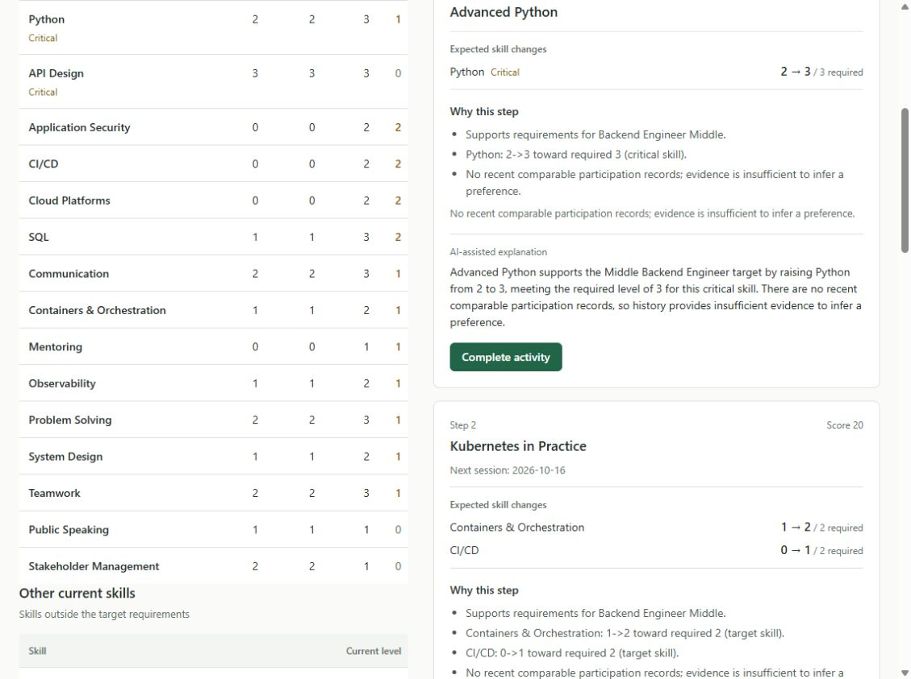

# Настоящий AI после входа — 2026-09-23

## Материалы для команды

На основном ноутбуке Backend в приложении `http://localhost:3000` выполнен вход под `employee2` (роль Employee). Профиль **E0058**, Ksenia Pavlova, Junior Backend Engineer → Middle, readiness **53.9%**. После настоящего серверного запроса OpenAI появились три блока **AI-assisted explanation**: EV_012, EV_010 и EV_040. Ответы и метки источника не подменялись.

- [Полный экран после входа](evidence/live-ai-2026-09-23/E0058-authenticated-ai-full.jpg): видны учётная запись, ID профиля и все три объяснения.
- [Крупный план объяснения](evidence/live-ai-2026-09-23/E0058-ai-explanation-closeup.jpg): Python 2 → 3 при требовании 3; модель объясняет критический навык, карьерную цель и недостаточность истории для вывода о предпочтениях.
- [Текст трёх объяснений из интерфейса](evidence/live-ai-2026-09-23/E0058-visible-explanations.txt).
- [Сохранённый вывод live-тестов](evidence/live-ai-2026-09-23/live-tests.txt).
- [SHA сборки, образа и контрольные суммы файлов](evidence/live-ai-2026-09-23/manifest.json).

Это скриншоты настоящего работающего интерфейса. Видео для этого AI-пруфа не записано; отдельная резервная fallback-запись описана в [FINAL_REHEARSAL.md](FINAL_REHEARSAL.md).

## Запущенная сборка

| Поле | Значение |
| --- | --- |
| Source SHA чистой сборки | `575aded07cb86f940cba8e3ab8fe1f8e1e8b9934` |
| Docker image ID | `sha256:3af368a7201c3d1e09633ef994905c22bed4c8aae31ad990f43bea066ae1eed2` |
| Контейнер | `newproject-app-1` |
| Модель | `gpt-6-astra` |
| Сравнённый main после PR #15 | `63d61140b437f66f71cdd0ca6b052a1431a167d3` |
| Отличия от этого main | Только четыре файла документации; приложение и конфигурация совпадают |

Source SHA зафиксирован при сборке из чистого клона, описанной в [PRIVACY_VALIDATION.md](PRIVACY_VALIDATION.md); текущий image ID проверен через `docker inspect`. SHA не встроен в изображение интерфейса или label образа. Последующий docs-коммит не следует выдавать за SHA запущенной сборки.

Скриншоты сохранены в 16:35 по местному времени (UTC+05:00). Health после проверки: schemaVersion 2; 60 skills, 32 role profiles, 200 employees, 40 events, **2746** history records. Это существующая demo-база с ранее сохранённым прогрессом. В ходе этой проверки активности не завершались и импорт не выполнялся.

## Live-тесты

Команда `npm run test:ai-live` выполнена в 16:36:08 (UTC+05:00), exit code **0**: **1 файл / 2 теста passed**, общая длительность **13.38 с**. Ключ загружен из игнорируемого серверного окружения. Тестовый checkout: `b61e1e80735f7f7fdac004a87a50f75ee54b80f6`; его код приложения и тестов совпадает с исходниками запущенной сборки, отличия только в документации.

[tests/openai-live.test.ts](../tests/openai-live.test.ts) выполняет реальные запросы для **E0178** и **E0058** в отдельных временных SQLite-базах и проверяет:

- у каждой рекомендации `explanationSource === "llm"` и непустой ответ модели;
- один вызов `getRecommendations` укладывается в **10 секунд**;
- event IDs, порядок, scores, skill effects и остальные детерминированные поля не изменены;
- завершённая история совпадает с исходным расчётом.

Сохранённый вывод репортера содержит итог серии, без имён кейсов, отдельных задержек и ответов модели. **13.38 с — длительность двух тестов вместе**, не одного AI-запроса. Привязка кейсов и SHA описана здесь и в manifest отдельно от исходного лога. Проверка браузера и тесты — разные реальные вызовы; текст ответов может различаться.

## Передача

Текстовые артефакты проверены на значения загруженных секретов и типичные credential-заголовки; оба изображения просмотрены отдельно. Ключей, паролей, cookie, заголовков авторизации и содержимого `.env` в пакете нет. Артефакты содержат только синтетический кейс и предназначены для команды/жюри в рамках хакатона; репозиторий приватный.

**НАПАРНИК/И:** требуемые скриншоты настоящего AI после входа, ID сотрудника, SHA сборки и сохранённый безопасный вывод live-тестов готовы. Совместный прогон выступления и проверка читаемости на проекторе остаются отдельными действиями команды.
